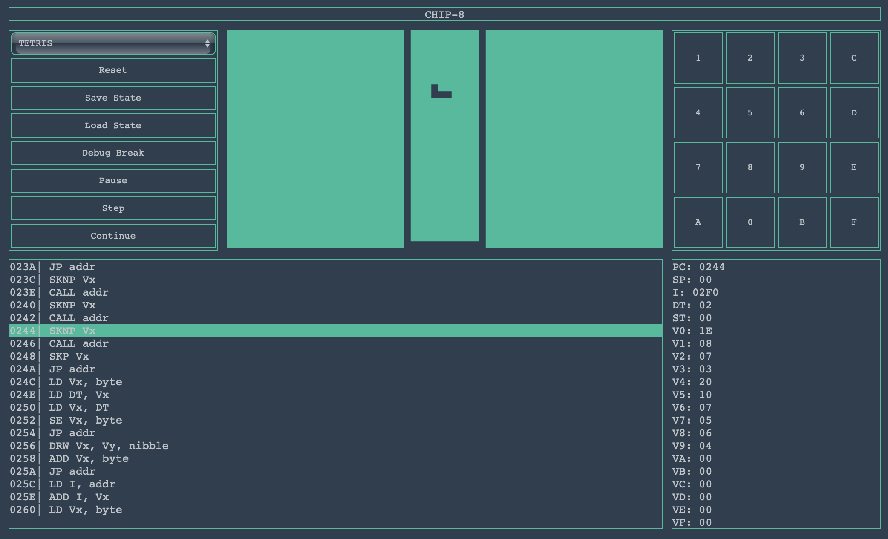

# chip-8-emulator-js      

# Try it!
https://alessandrocuzzocrea.github.io/chip-8-emulator-js/

## License

The MIT License (MIT). Copyright (c) 2018 Alessandro Cuzzocrea

## Resources

* http://mattmik.com/chip8.html
* http://devernay.free.fr/hacks/chip8/C8TECH10.HTM
* http://www.badlogicgames.com/wordpress/?p=3564
* http://www.multigesture.net/articles/how-to-write-an-emulator-chip-8-interpreter/
* http://blog.alexanderdickson.com/javascript-chip-8-emulator
* https://massung.github.io/CHIP-8/
